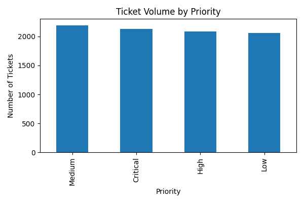
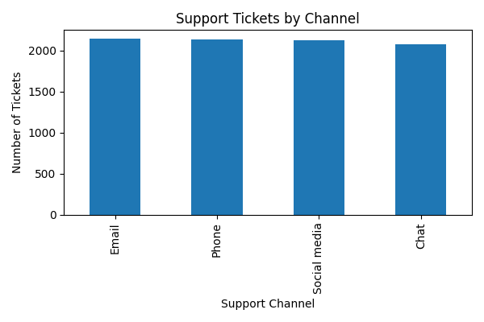
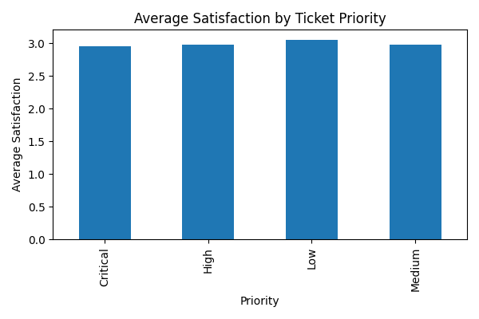

# Customer Support Ticket Analysis

## Project Overview
For my capstone case study, I analyzed a customer support ticket dataset from Kaggle. The goal was to better understand how ticket priority, support channel, and satisfaction ratings relate to customer support performance. This project connects to my own customer service and technical support experience, so it felt realistic and useful for my portfolio.

## Phase 1: Ask

### Business Task
How do ticket priority and support channel relate to customer satisfaction and ticket volume?

### Stakeholders
- Customer support managers
- Customer service teams
- Quality assurance teams
- Business leadership

## Phase 2: Prepare

### Data Source
The dataset came from Kaggle and included customer support ticket records.

### Dataset Details
- 8,469 rows
- 17 columns
- Includes ticket priority, ticket status, support channel, ticket type, and satisfaction ratings

## Phase 3: Process

### Cleaning Steps
- Reviewed column names and data types
- Checked for missing values
- Removed or ignored incomplete records when needed
- Created a cleaned version of the dataset for portfolio use
- Protected customer privacy by not displaying customer names or emails

### Tools Used
- Python/Pandas
- SQL
- GitHub
- Data visualization

## Phase 4: Analyze

### Key Findings
- Ticket volume was spread across different priority levels.
- Support channels included chat, email, phone, and social media.
- Satisfaction ratings helped show how customers experienced support.
- Some missing satisfaction and resolution-time data affected the analysis.

## Phase 5: Share

### Visualization 1: Ticket Volume by Priority

This chart shows the number of support tickets by priority level.

### Visualization 2: Support Tickets by Channel

This chart compares ticket volume across support channels.

### Visualization 3: Average Satisfaction by Ticket Priority

This chart shows how average satisfaction ratings compare by ticket priority.

## Phase 6: Act

### Recommendations
- Track satisfaction ratings by ticket type and priority.
- Review high-priority and critical tickets more closely.
- Compare support channels to see where customers have the best experience.
- Improve data collection for missing satisfaction and resolution-time fields.
- Use dashboards to monitor ticket volume and customer satisfaction over time.

## Project Files
- Customer Support Capstone Case Study PDF
- Cleaned Customer Support Dataset
- SQL Query File
- Dashboard/Chart Images

## Summary
This project demonstrates data cleaning, exploratory analysis, SQL practice, data visualization, and storytelling with data. It also connects closely to customer service work, which makes it a practical project to discuss with employers.
